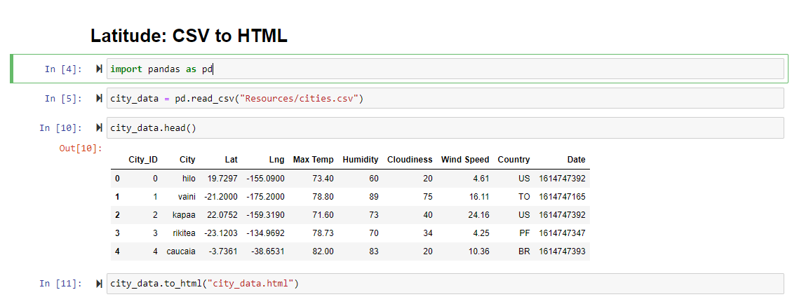
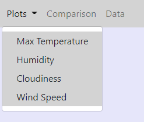
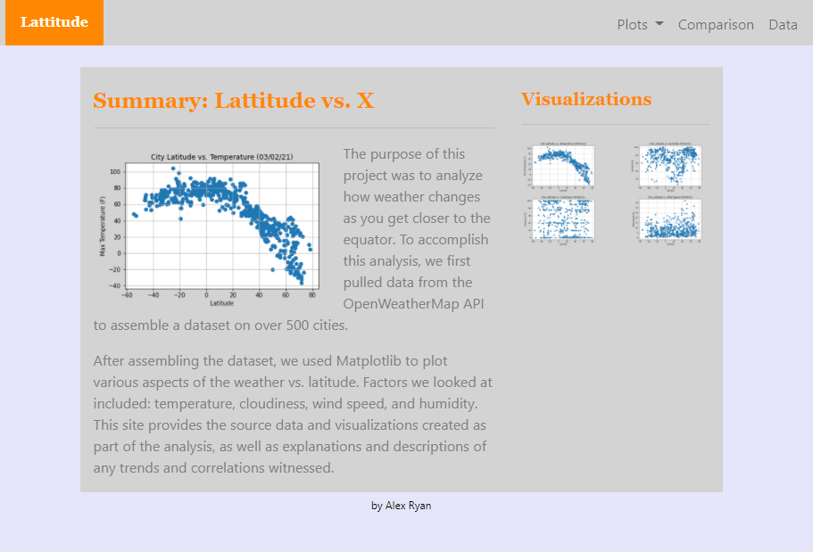
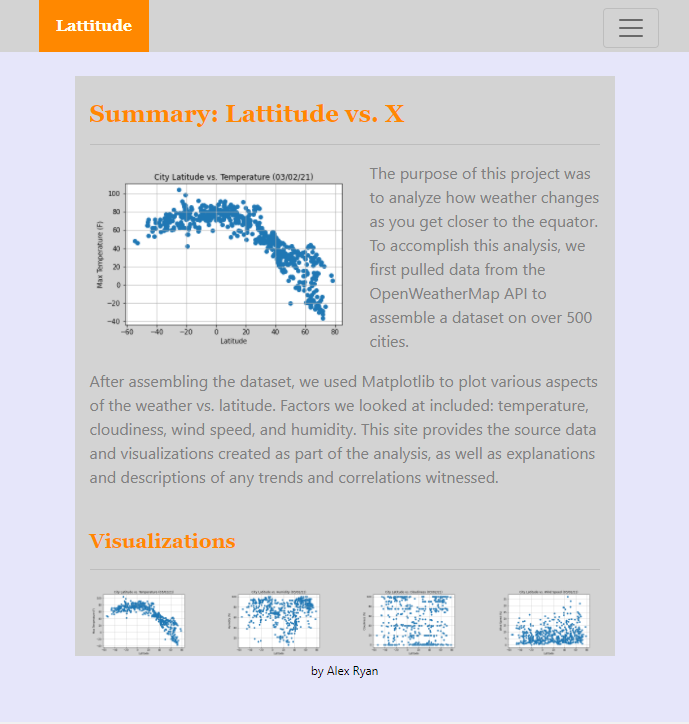
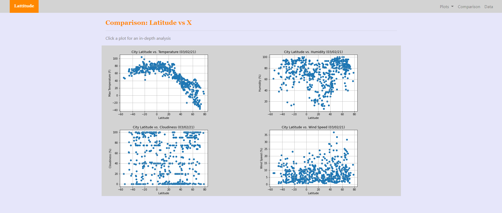
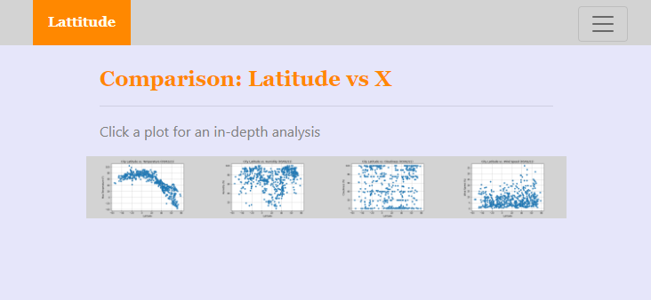
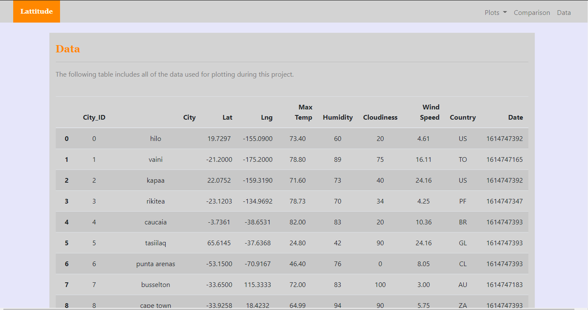
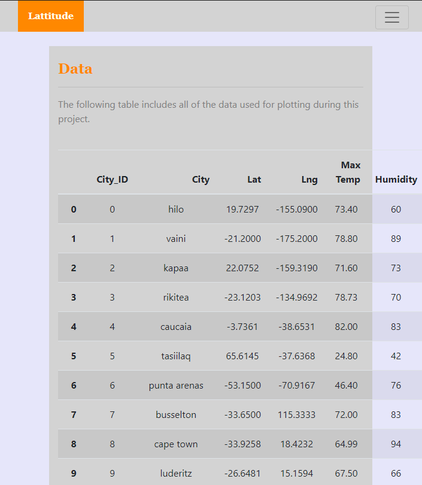
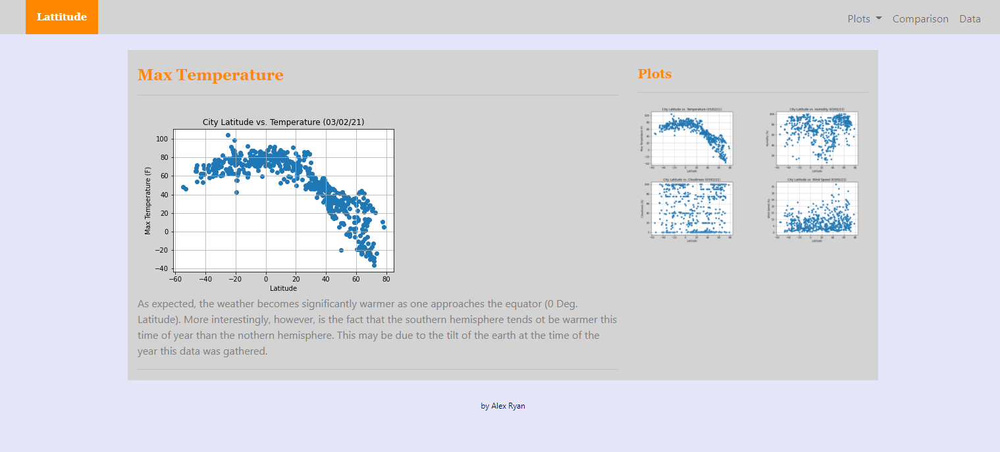
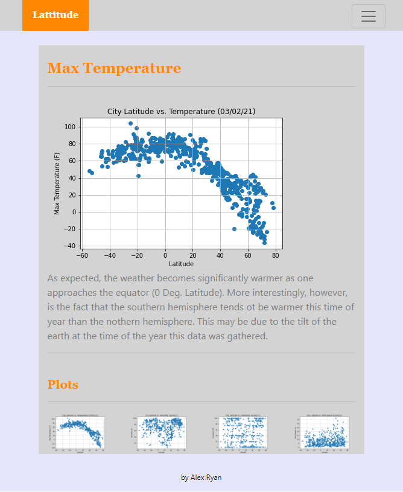

Landing page can be found on Github pages [here](https://jaryan77.github.io/Latitude/)

# Latitude - Latitude Analysis Dashboard with Attitude

## Background

In the project, I created a dashboard using HTML and CSS to visualize weather data used in a past project, [What's the Weather Like](https://github.com/jaryan77/Whats-the-Weather-Like).

## Latitude - Latitude Analysis Dashboard with Attitude

For this project I will be creating a visualization dashboard website using visualizations I created in a past project. Specifically, I will be plotting [this weather data](Resources/cities.csv).

In building this dashboard, I will create individual pages for each plot and a means by which the user can navigate between them. These pages will contain the visualizations and their corresponding explanations. I'll also have a landing page, a page where one can see a comparison of all of the plots, and another page where one can view the data used to build them.

### Website Properties

For reference, see the ["Screenshots" section](#screenshots) below.

The website consists of 7 pages total, including:

* A [landing page](https://jaryan77.github.io/Latitude/) containing:
  * An explanation of the project.
  * Links to each visualizations page. There should be a sidebar containing preview images of each plot, and clicking an image should take the user to that visualization.
* Four [visualization pages](https://jaryan77.github.io/Latitude/visual_temp.html), each with:
  * A descriptive title and heading tag.
  * The plot/visualization itself for the selected comparison.
  * A paragraph describing the plot and its significance.
* A ["Comparisons" page](https://jaryan77.github.io/Latitude/visual_temp.html) that:
  * Contains all of the visualizations on the same page so we can easily visually compare them.
  * Uses a Bootstrap grid for the visualizations.
    * The grid must be two visualizations across on screens medium and larger, and 1 across on extra-small and small screens.
* A ["Data" page](https://jaryan77.github.io/Latitude/data.html) that:
  * Displays a responsive table containing the data used in the visualizations.
    * The table is a bootstrap table component. [Hint](https://getbootstrap.com/docs/4.3/content/tables/#responsive-tables)
    * The data has come from exporting the `.csv` file as HTML, using pandas. Pandas has a nifty method approprately called `to_html` that allows you to generate a HTML table from a pandas dataframe. See the documentation [here](https://pandas.pydata.org/pandas-docs/version/0.17.0/generated/pandas.DataFrame.to_html.html)

    

The website also has a navigation menu at the top of each page that:

* Has the name of the site on the left of the nav which allows users to return to the landing page from any page.

    

* Contains a dropdown menu on the right of the navbar named "Plots" that provides a link to each individual visualization page.
* Provides two more text links on the right: "Comparisons," which links to the comparisons page, and "Data," which links to the data page.
    
* Is responsive (using media queries). The nav must have similar behavior as the screenshots ["Navigation Menu" section](#navigation-menu) (notice the background color change).

### Screenshots

This section contains screenshots of each page that must be built, at varying screen widths. These are a guide; you can meet the requirements without having the pages look exactly like the below images.

#### Landing page

Large screen:

Small screen:



#### Comparisons page

Large screen:

Small screen:

#### Data page

Large screen:

Small screen:

#### Visualization pages

You'll build four of these, one for each visualization. Here's an example of one:

Large screen:

Small screen:

